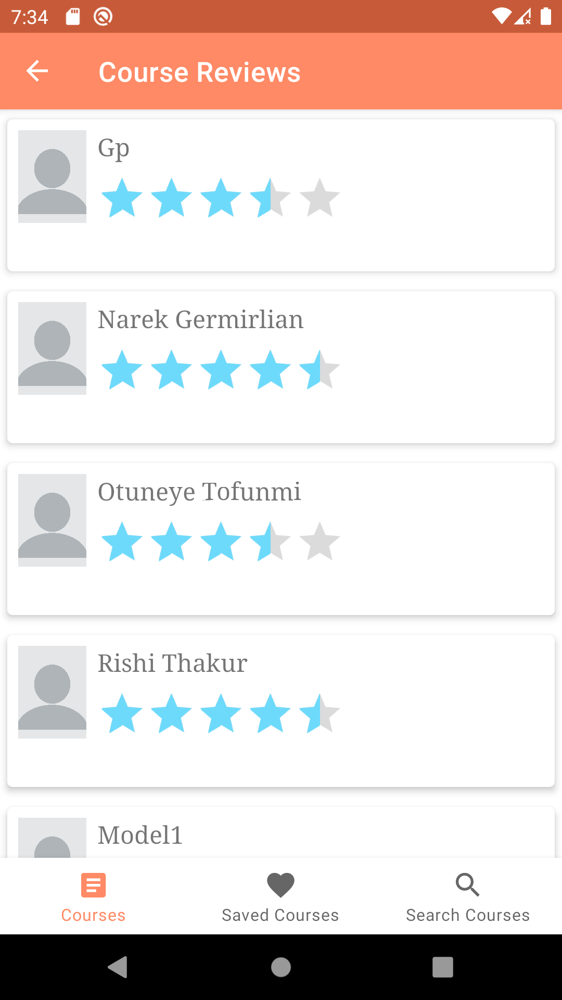

# Teach Me

App displaying Udemy courses using [Udemy API](https://www.udemy.com/developers/affiliate/).

## Features

- Display Udemy courses allowing users to browse and explore them.
- Display detailed information about each course.
- Search and display courses matching the search word inputs.
- Save favorite courses on the local devices.
- View the rating and comments of others on each course.

## Libraries

- [Glide](https://github.com/bumptech/glide)
- [Retrofit](https://square.github.io/retrofit/)
- [MATERIAL DESIGN](https://material.io/components)
- [Coroutines](https://kotlinlang.org/docs/coroutines-overview.html)
- [Room Database](https://developer.android.com/training/data-storage/room)
- [Navigation Component](https://developer.android.com/guide/navigation)
- [ViewModel](https://developer.android.com/topic/libraries/architecture/viewmodel)
- [LiveData](https://developer.android.com/topic/libraries/architecture/livedata)
- [View Binding](https://developer.android.com/topic/libraries/view-binding)
- [Pagination](https://developer.android.com/topic/libraries/architecture/paging/v3-overview)
- [MVVM Architecture](https://en.wikipedia.org/wiki/Model%E2%80%93view%E2%80%93viewmodel)

## Screenshots

    

